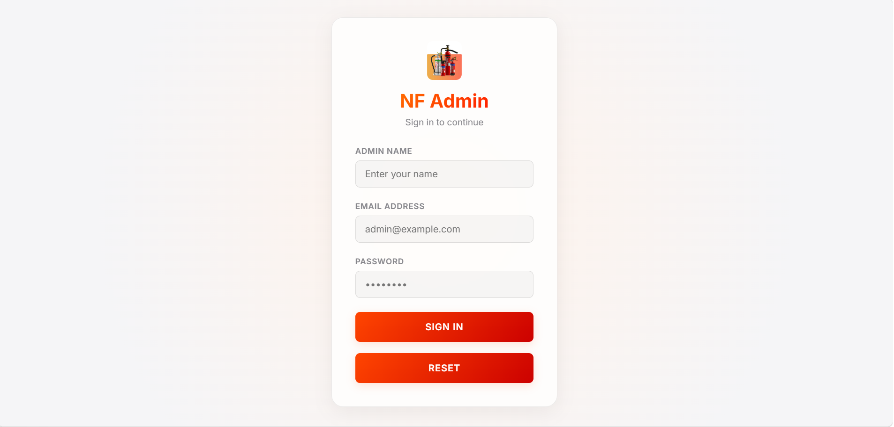
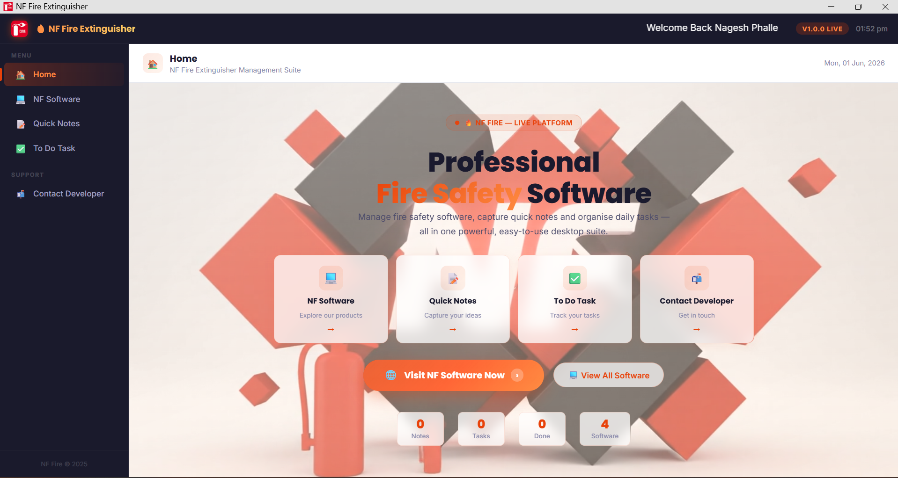



# NF Fire Extinguisher

 

NF Fire Extinguisher is a compact web application used to manage product listings, orders, and vendor submissions for fire safety equipment. This README now contains the company branding and core contact information only.
 

 

 

 

  

Company: NF Fire Extinguisher

Developer: Harshad Teli

CEO: Nagesh Phalle

## Certificate

This is to certify that **Harshad Teli** has contributed to and is acknowledged for the development and maintenance of the NF Fire Extinguisher software, as recognized by NF Fire Extinguisher.

Issued by: NF Fire Extinguisher

Authorized signatory: Nagesh Phalle (CEO)

Date: June 1, 2026.
